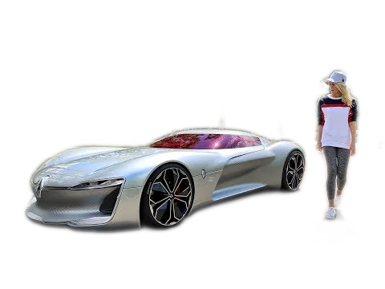
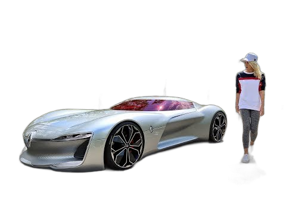
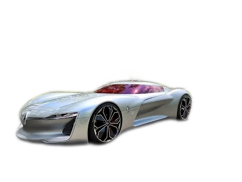
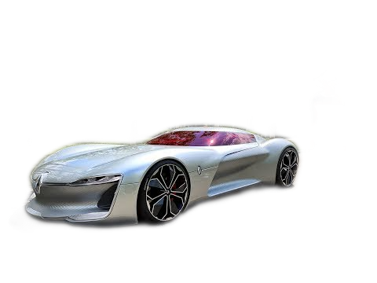
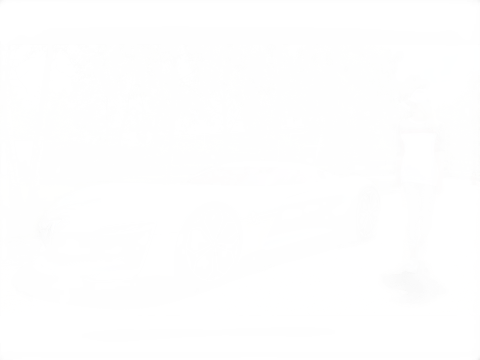
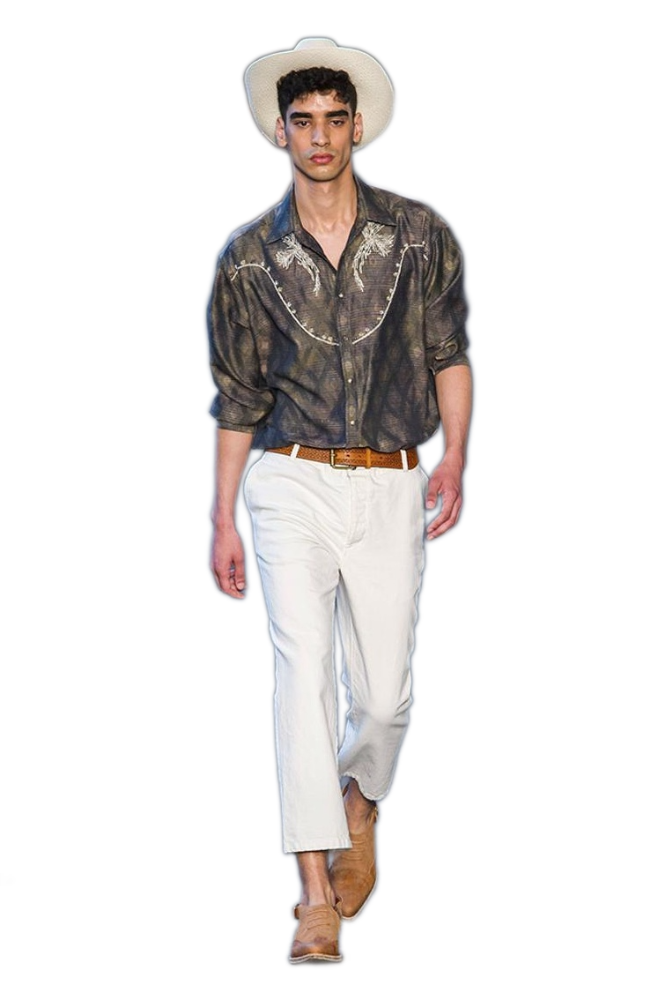
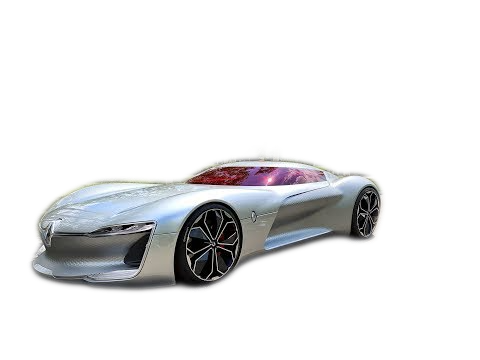
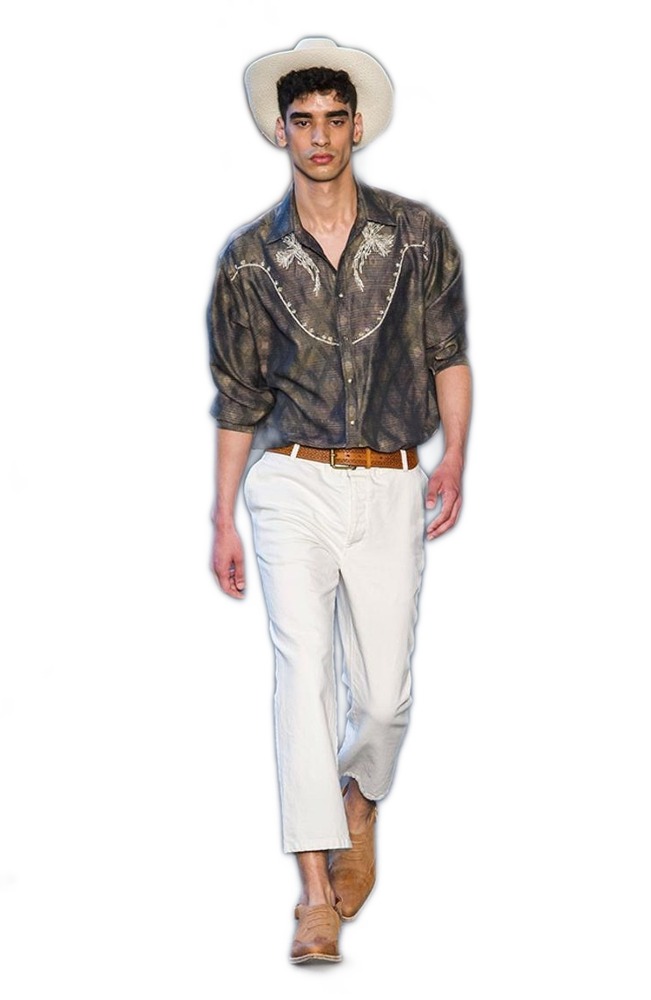
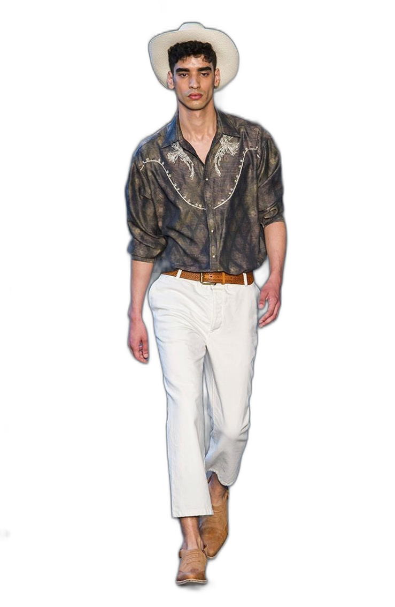

# Model Comparison Results

This document compares the results from our rembg implementation against the original rembg results.

## Quick Performance Overview

| Model             | Source                                               | TS (this) rewrite                                                 | Python (source) Implementation                                     | Notes                    |
| ----------------- | ---------------------------------------------------- | ----------------------------------------------------------------- | ------------------------------------------------------------------ | ------------------------ |
| isnet-anime       |  |  |  | Specialized for anime    |
| isnet-general-use |                |   |   | General purpose          |
| silueta           |                |             |             | Good for objects         |
| u2net             |          |            |            | Classic model            |
| u2net_cloth_seg   |            |   |   | Specialized for clothing |
| u2net_human_seg   |                |     |     | Specialized for humans   |
| u2netp            |                |              |              | Lightweight version      |

## Detailed Model Comparisons

### ISNet Anime

| Source                                               | Our Result                                                        | Original Result                                                    |
| ---------------------------------------------------- | ----------------------------------------------------------------- | ------------------------------------------------------------------ |
|  |  |  |
|                |         |         |
|            |       |       |
|          |      |      |

### ISNet General Use

| Source                                               | Our Result                                                              | Original Result                                                          |
| ---------------------------------------------------- | ----------------------------------------------------------------------- | ------------------------------------------------------------------------ |
|  |  |  |
|                |         |         |
|            |       |       |
|          |      |      |

### Silueta

| Source                                               | Our Result                                                    | Original Result                                                |
| ---------------------------------------------------- | ------------------------------------------------------------- | -------------------------------------------------------------- |
|  |  |  |
|                |         |         |
|            |       |       |
|          |      |      |

### U2Net

| Source                                               | Our Result                                                  | Original Result                                              |
| ---------------------------------------------------- | ----------------------------------------------------------- | ------------------------------------------------------------ |
|  |  |  |
|                |         |         |
|            |       |       |
|          |      |      |

### U2Net Cloth Segmentation

| Source                                               | Our Result                                                            | Original Result                                                        |
| ---------------------------------------------------- | --------------------------------------------------------------------- | ---------------------------------------------------------------------- |
|  |  |  |
|                |         |         |
|            |       |       |
|          |      |      |

### U2Net Human Segmentation

| Source                                               | Our Result                                                            | Original Result                                                        |
| ---------------------------------------------------- | --------------------------------------------------------------------- | ---------------------------------------------------------------------- |
|  |  |  |
|                |         |         |
|            |       |       |
|          |      |      |

### U2NetP (Lightweight)

| Source                                               | Our Result                                                   | Original Result                                               |
| ---------------------------------------------------- | ------------------------------------------------------------ | ------------------------------------------------------------- |
|  |  |  |
|                |         |         |
|            |       |       |
|          |      |      |
